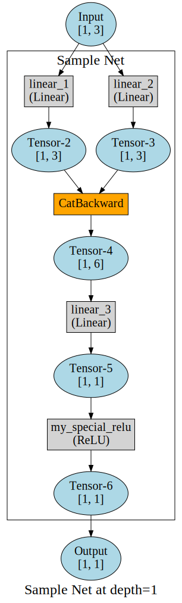
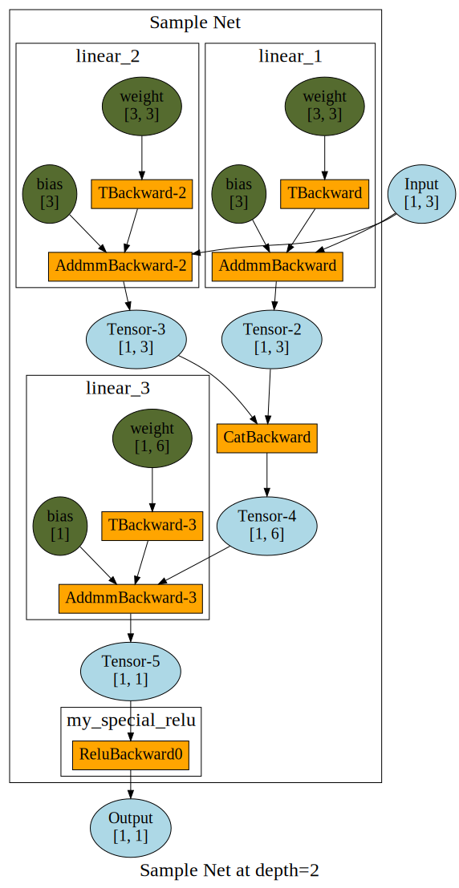

PyTorchRec
==========

A small package to record execution graphs of neural networks in PyTorch.
The package uses hooks and the `grad_fn` attribute to record information.  
This can be used to generate visualizations at different resolution depths. 

Licensed under MIT License.

## Installation

(Tested on `torch 1.3.0+cpu`).  
Install [graphviz](https://graphviz.gitlab.io/) for your system.

Install this package:

```
pip install git+https://github.com/ahgamut/pytorchrec
```

## Usage

Consider the below sample network:

```python
from torch import nn
class SampleNet(nn.Module):
    def __init__(self):
        nn.Module.__init__(self)

        self.linear_1 = nn.Linear(in_features=3, out_features=3, bias=True)
        self.linear_2 = nn.Linear(in_features=3, out_features=3, bias=True)
        self.linear_3 = nn.Linear(in_features=6, out_features=1, bias=True)
        self.my_special_relu = nn.ReLU()

    def forward(self, inputs):
        x = self.linear_1(inputs)
        y = self.linear_2(inputs)
        z = torch.cat([x, y], dim=1)
        z = self.my_special_relu(self.linear_3(z))
        return z
```

The package can be used like this:

```python
import sys
from torchrec import record, make_dot

def main():
    net = SampleNet().cpu()
    i = int(sys.argv[1])
    rec = torchrec.record(net, input_shapes=(1, 3), name="Sample Net")
    g = torchrec.make_dot(rec, render_depth=i)
    # g is a graphviz.Digraph() object
    g.format = "svg"
    g.attr(label="Sample Net at depth={i}".format(i=i))
    g.render("sample-{i}".format(i=i), directory=".", cleanup=True)


if __name__ == "__main__":
    main()

```

And visualizations like these can be produced:







## Acknowledgements

This is inspired from [szagoruyko/pytorchviz](https://github.com/szagoruyko/pytorchviz).
