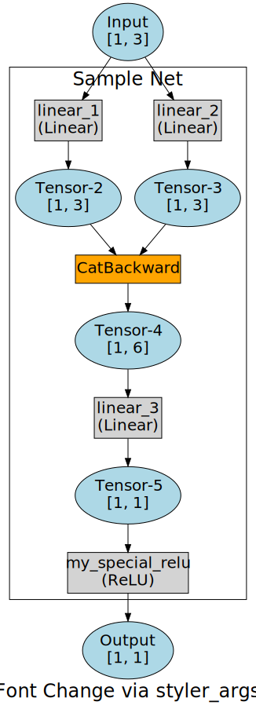

User Guide
==========

``torchrecorder`` is pure Python3 code, it does not contain any C modules.

Installation
------------

Requirements:

* `PyTorch <https://pytorch.org>`_ v1.3 or greater (the ``cpu`` version is only required)
* The `Graphviz <https://graphviz.gitlab.io>`_ library and its `Python interface <https://graphviz.readthedocs.io/en/stable/manual.html>`_

Install via ``pip`` and PyPI:

.. code-block:: bash

    $ pip install torchrecorder

Install via ``pip`` and the Github repo:

.. code-block:: bash

    $ pip install git+https://github.com/ahgamut/torchrecorder/

Examples
--------

The default usage is via the `~torchrecorder.render_network` wrapper function.

.. literalinclude:: ../../examples/sample.py
    :lines: 1-34
    :emphasize-lines: 3, 26-33

|sample|

The render_network function calls `~torchrecorder.record` and `~torchrecorder.make_dot` so the call to 
`~torchrecorder.render_network`  in the above example could be written as below, to allow for 
any modifications to the `~graphviz.Digraph` after rendering.

.. literalinclude:: ../../examples/sample.py
    :lines: 36-46

Styling `graphviz` attributes
^^^^^^^^^^^^^^^^^^^^^^^^^^^^^

To change the default styling attributes of every node, you can pass any number of `graphviz`\ -related attributes [#graphviz_kwds]_ 
as keyword arguments to `~torchrecorder.render_network` (or `~torchrecorder.make_dot`\ ). 
The below example sets ``Lato`` as the default font.

.. literalinclude:: ../../examples/styleargs.py
    :lines: 23-30

|styler1|

Custom Styler Objects
^^^^^^^^^^^^^^^^^^^^^

If the default styling of node shapes/colors is not sufficient, you can create a subclass of `~torchrecorder.renderer.GraphvizStyler` and
pass it to `~torchrecorder.make_dot` via the ``styler_cls`` argument. The subclass needs to accepts `graphviz` attributes as keyword arguments,
and override the `~torchrecorder.renderer.GraphvizStyler.style_node` and `~torchrecorder.renderer.GraphvizStyler.style_edge` methods.

In the below example, I construct a styler subclass that shows some parameters of `~torch.nn.Conv2d` objects, draws orange edges 
out of `~torch.nn.Conv2d` objects, and blue edges into `~torch.nn.ReLU` objects:

.. literalinclude:: ../../examples/newstyler.py
    :lines: 6-22, 24-59

|styler2|

Rendering into different formats
^^^^^^^^^^^^^^^^^^^^^^^^^^^^^^^^

Currently, the `torchrecorder` package only provides rendering into `graphviz` objects, but the rendering functionality 
can be extended by subclassing the `~torchrecorder.renderer.base.BaseRenderer` class in a manner similar to the `~torchrecorder.renderer.GraphvizRenderer`.
You can read the source code to see how the subclassing can be done.

If you create a subclass of `~torchrecorder.renderer.base.BaseRenderer` for a new rendering format, submit a pull request! 
I've been trying to render in a `SigmaJS <http://sigmajs.org/>`_\ -compatible format, but haven't been able to.

.. |sample| image:: ../../examples/Sample\ Net-1.svg
          :height:  600px
          :width:   300px

.. |styler2| image:: ../../examples/CustomStyler-1.svg
          :height:  600px
          :width:   300px

.. [#graphviz_kwds] the list of graphviz node attributes can be seen at https://graphviz.gitlab.io/_pages/doc/info/attrs.html

